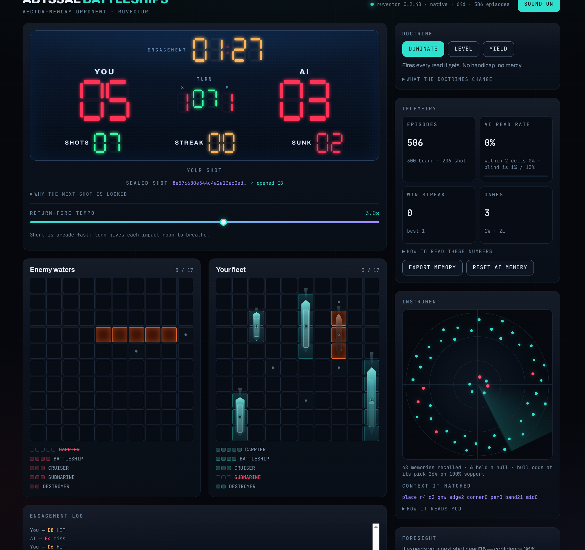

<p align="center">
  
</p>

<p align="center">
  <a href="#install-and-run"></a>
  
  
  
</p>

# Abyssal Battleships

Battleships against an opponent that **remembers where you hide your fleet**.

<p align="center">
  
</p>

Most computer Battleships opponents guess. They fire at random until something
connects, then work outward from the hit. This one does that too — but only on
its first game. After every finished game it writes down where your ships
actually were, and before every shot it asks its own memory a question:

> *"When a square looked like this one before, was there a hull under it?"*

The more games you leave behind, the less its opening shots look like guesses.

<p align="center">
  
</p>

---

## Contents

- [What makes it different](#what-makes-it-different)
- [Install and run](#install-and-run)
- [start.sh reference](#startsh-reference)
- [How to play](#how-to-play)
- [The three doctrines](#the-three-doctrines)
- [Reading the instruments](#reading-the-instruments)
- [How the memory actually works](#how-the-memory-actually-works)
- [Architecture](#architecture)
- [HTTP API](#http-api)
- [Project layout](#project-layout)
- [The AI's memory on disk](#the-ais-memory-on-disk)
- [Troubleshooting](#troubleshooting)

---

## What makes it different

<p align="center">
  
</p>

**It learns across games, not within one.** The knowledge lives on disk, so
closing the tab does not reset it. Beat it ten times and it will have ten games
worth of notes about your habits.

**It commits to its shot before you fire.** Each turn the opponent picks its
target, then shows you a fingerprint (a hash) of that choice. After the round
resolves, the page reopens the move and rebuilds the fingerprint to prove the
target did not change after it saw your shot.

> **Honest caveat:** this proves the target was not *altered* mid-turn. It does
> not prove it was chosen *fairly* — the opponent and the checker both run in
> the same process. Treat it as a working demonstration of commit-and-reveal,
> not as a referee.

**It shows its work.** A radar scope draws every memory the opponent recalled
for its current shot: closer to the centre means a more similar past situation,
larger means it counted for more, red means that memory had a hull in it.

**It will tell you your own next move.** The Foresight panel shows where the
opponent expects *you* to fire next, and how confident it is. Looking does not
change anything — the prediction is made before you act either way.

---

## Install and run

### What you need

| Requirement | Why |
|---|---|
| **Node.js 20 or newer** | `ruvector` ships native bindings that need Node ≥ 20 |
| **npm** | Installs the one dependency (comes with Node) |
| **bash** | `start.sh` is a bash script — Linux, macOS, or WSL |
| **curl** | `start.sh` uses it to confirm the server is really answering |
| `lsof` *(optional)* | Cleaner port cleanup; falls back to `pkill` without it |

Check what you have:

```bash
node --version   # must print v20.x or higher
npm --version
```

### Get it running

```bash
git clone https://github.com/dgdev25/battleships.git
cd battleships
./start.sh
```

That is the whole install. `start.sh` handles the rest: it verifies your Node
version, installs dependencies on first run, syntax-checks the server, starts
it, and waits until the server genuinely answers an HTTP request before telling
you it is ready.

If the script is not executable yet:

```bash
chmod +x start.sh
```

When it finishes you will see:

```
┌──────────────────────────────────────────────────────────────────┐
│  abyssal-battleships is running                                  │
├──────────────────────────────────────────────────────────────────┤
│  Game      ──  http://localhost:47801                            │
│  API       ──  http://localhost:47801/api/config                 │
├──────────────────────────────────────────────────────────────────┤
│  Logs:   /path/to/battleships/logs/                              │
│  Memory: /path/to/battleships/data/                              │
│  Stop:   ./start.sh --stop                                       │
│  Wipe:   ./start.sh --wipe-memory                                │
└──────────────────────────────────────────────────────────────────┘
```

Open **http://localhost:47801** and play.

> The first run installs `ruvector`, which compiles native bindings. Give it a
> minute. Later runs skip the install entirely.

### Stopping it

```bash
./start.sh --stop
```

---

## start.sh reference

```bash
./start.sh                 # start the server (installs deps if needed)
./start.sh --stop          # stop it
./start.sh --rebuild       # force a fresh npm install, then start
./start.sh --wipe-memory   # delete the AI's learned episodes, then start
./start.sh --reset-ports   # forget the saved port; next run picks a new one
```

**About the port.** The port is chosen once and then written back into
`start.sh` itself, so the game lives at the same address every time. It is
currently **47801**. If something else claims that port, run
`./start.sh --reset-ports` and the next start picks a free one from the
47800–47899 range.

**Restarting is safe.** Every start first kills whatever is holding the port,
so you can re-run `./start.sh` after a code change without stopping first.

**Logs** are written to `logs/server.log`. If the server dies on startup, that
file has the reason.

### Running it without start.sh

The app never hardcodes a port — it reads `PORT` from the environment and
refuses to boot without it:

```bash
npm install
PORT=3000 npm start
```

Optionally point the memory somewhere else with `BATTLE_DATA_DIR`:

```bash
PORT=3000 BATTLE_DATA_DIR=/tmp/abyssal-memory npm start
```

---

## How to play

**1. Deploy your fleet.** Click a square on *Your fleet* to drop the next ship.
Press **R** to rotate between horizontal and vertical. A live preview shows
where the ship will land — red means it will not fit or would overlap.

The fleet is the standard five:

| Ship | Length |
|---|---|
| Carrier | 5 |
| Battleship | 4 |
| Cruiser | 3 |
| Submarine | 3 |
| Destroyer | 2 |

Seventeen cells in total. In a hurry? **Scatter fleet** places all five at
random. **Clear** starts the deployment over.

**2. Engage.** The button unlocks once all five ships are down.

**3. Fire.** Click any square in *Enemy waters*. You fire, then the opponent
fires back — one shot each, every turn. Sink all five enemy ships before it
sinks yours.

The **Return-fire tempo** slider changes the pause between your impact and the
opponent's launch from 0.2 to 2.5 seconds. Missile flight time stays intact, so
the whistle still reaches the impact naturally. The setting is remembered by
the browser.

**4. Play again.** Whoever wins, the board you used is written into the
opponent's memory before the next game starts. That is the point: the game you
just played is the reason the next one is harder.

---

## The three doctrines

These change **what the opponent does with a read**, not how hard it reads you.
The prediction runs at full strength in all three.

| Doctrine | Behaviour |
|---|---|
| **Dominate** | Fires at the cell its memory rates highest. No handicap. |
| **Level** | Steers toward a tied score — deliberately wastes shots while it is ahead of you. |
| **Yield** | Once its read is strong, it fires at the water it is *most sure is empty*. On a weak read it holds mid-table rather than throwing the shot away at random. |

Yield is the interesting one: an opponent that reads you perfectly and then
uses that to miss on purpose is still demonstrating that it read you.

---

## Reading the instruments

**AI read rate** — how often the opponent named your *exact* next square before
you fired it. The number to beat is **1%**, not 50%: a blind guess on a
hundred-square grid is right one time in a hundred. The sub-line gives its
within-two-squares rate, where blind guessing sits near 13%.

> Read rate is not the score. In Level or Yield the opponent throws shots away
> on purpose, so you can be far ahead on points while it still reads you
> perfectly.

**Episodes** — how many individual memories are stored. Each finished game adds
100 board memories (one per square of your ocean) plus one memory per shot.

**Instrument scope** — the memories recalled for the current shot. Nearer the
centre means a more similar past situation; bigger means it carried more
weight; red means that memory had a hull in it.

**Sealed shot** — the fingerprint of the opponent's committed target, and
whether it verified after the round.

---

## How the memory actually works

After every game the opponent writes one short note per square of your ocean.
The note is not a sentence — it is a dense description of *where the square
sits*:

```
place r3 c7 qne edge2 corner0 par0 band13 mid0
```

That reads as: a placement memory, row 3, column 7, north-east quadrant, two
squares from the nearest edge, not a corner, even parity, band 1-3, not in the
middle box. Each note is stored against the truth of whether a hull was
actually there.

Those notes become fixed lists of **64 numbers** in a
[`ruvector`](https://www.npmjs.com/package/ruvector) store, using cosine
distance. Squares that resemble each other end up near each other in that
space.

Before each shot the opponent writes the note for every square it has not tried
yet, finds the closest notes in memory, and lets them vote on whether you hide
ships in places like that. Closer and more recent memories count for more.

It also keeps a second, separate set of notes about **your** shooting — recent
hits and misses, who is ahead, how deep into the game you are — which is what
drives the Foresight prediction.

It is not reasoning about naval tactics. It is doing similarity search over its
own history.

**With an empty memory** it falls back to classic hunt-and-target play, so the
first game is a normal game of Battleships.

---

## Architecture

<p align="center">
  
</p>

One Node process serves both the JSON API and the static front-end. There is no
build step, no bundler, and no framework — the browser loads ES modules
directly. Game sessions live in memory and are dropped when the game ends; the
learning is what persists, on disk.

---

## HTTP API

| Method | Path | Purpose |
|---|---|---|
| `GET` | `/api/config` | Board size, fleet spec, doctrines, memory backend, lifetime stats |
| `POST` | `/api/game` | Open a game. Body: `{ mode, placement }` |
| `POST` | `/api/fire` | Fire a shot. Body: `{ gameId, r, c }` |
| `GET` | `/api/memory/export` | Dump everything the opponent has learned, as JSON |
| `POST` | `/api/memory/reset` | Erase the opponent's memory |

`POST /api/fire` resolves your shot *and* the opponent's reply in one call, and
returns the complete new state: both boards, telemetry, the recall scope, the
next sealed shot, and the next foresight prediction.

Quick look:

```bash
curl -s http://localhost:47801/api/config | head -c 400
```

---

## Project layout

```
battleships/
├── src/
│   ├── server.mjs    HTTP surface — static files plus the JSON API
│   ├── game.mjs      Board, fleet, placement, shot resolution. Pure rules.
│   ├── ai.mjs        The opponent: notes, recall, voting, doctrines, sealing
│   └── memory.mjs    ruvector store — embedding, persistence, statistics
├── public/
│   ├── index.html    The whole page
│   ├── app.js        Deployment, firing, and the instrument readouts
│   ├── scoreboard.js Stadium scoreboard built from real seven-segment digits
│   ├── ships.js      Oriented fleet geometry and shaped hull overlays
│   ├── fx.js         Finite fireball, smoke, spark, and water effects
│   ├── sfx.js        Recorded explosion plus procedural battle audio
│   ├── audio/        Bundled public-domain field recording and source notes
│   └── styles.css    Sonar HUD
├── assets/           Diagrams used by this README
├── start.sh          The launcher
├── data/             The AI's memory (created on first finished game, gitignored)
└── logs/             Server logs (gitignored)
```

The explosion body is a bundled 24 KB public-domain field recording from
Wikimedia Commons. Web Audio layers in the crack, sub-bass, rumble, debris,
missile whistle, air rush, and water splash; it also supplies a procedural
explosion fallback. See `public/audio/README.md` for provenance and checksum.

---

## The AI's memory on disk

Everything the opponent has learned lives in `data/`. It is **not** in version
control.

```bash
./start.sh --wipe-memory     # erase it and start fresh
```

You can also erase it from the page — **Reset AI memory** in the Telemetry
panel — or take a copy with **Export memory**, which downloads the whole store
as readable JSON.

Deleting `data/` is always safe. The opponent simply goes back to playing
blind.

---

## Troubleshooting

**`node not found` or `Node 18 is too old`**
`ruvector` needs Node 20 or newer. Install a current Node and try again.

**Port 47801 is already in use**
`start.sh` kills whatever is holding the port before it starts, so this is
usually handled. If the port genuinely belongs to another application, run
`./start.sh --reset-ports` and the next start picks a different one.

**The server exits immediately**
Read `logs/server.log` — the reason will be the last few lines.

**`PORT is not set`**
You ran `node src/server.mjs` directly. Use `./start.sh`, or set the port
yourself: `PORT=3000 npm start`.

**Install takes a long time on first run**
Expected. `ruvector` compiles native bindings. Only the first run pays for it.

**The opponent feels random**
It probably is, for now — check the *episodes* counter. With an empty memory it
plays classic hunt-and-target. It needs finished games to learn from.

**The page loads but the fonts look plain**
The webfonts come from Google Fonts and load off the critical path on purpose,
so the game still works offline or on a blocked network. It falls back to your
system fonts.

---

<p align="center">
  <sub>One Node process · one dependency · no build step · no framework</sub>
</p>
